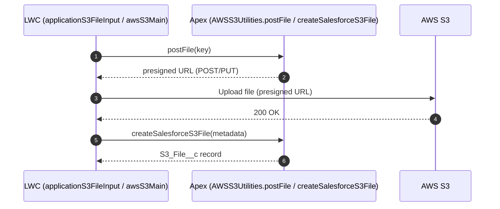
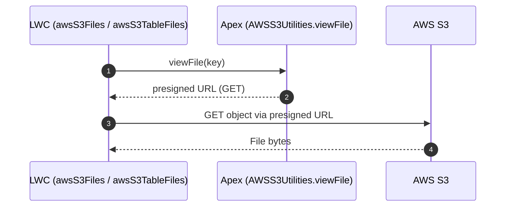
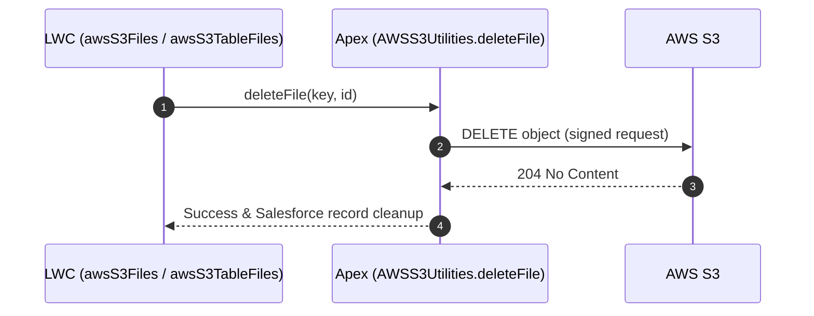

# Salesforce S3 Integration — Technical Documentation

[Contribution Guide](https://github.com/effordDev/contribution)

## Overview

This package implements an AWS S3-backed file storage flow in Salesforce using Apex utilities and Lightning Web Components (LWCs). It includes configuration for CSP Trusted Sites (for Experience Cloud/Lightning fetch/XHR), and (optionally) Remote Site Settings for Apex callouts.

---

## Apex Classes

### AWSS3BucketVisibilityPicklist

-   **Type:** class
-   **Sharing:** (default sharing)

#### Methods

-   `global override VisualEditor.DataRow getDefaultValue()`
    -   Return the default picklist value for S3 bucket visibility.
-   `global override VisualEditor.DynamicPickListRows getValues()`
    -   Return available visibility picklist options (e.g., internal/external).

### AWSS3BucketVisibilityPicklistTest

-   **Type:** class
-   **Sharing:** (default sharing)

#### Methods

-   `@isTest private static void getDefaultValueTest()`
    -   Unit test method.
-   `@isTest private static void getValuesTest()`
    -   Unit test method.

### AWSS3MockCallout

-   **Type:** class
-   **Sharing:** (default sharing)

#### Methods

-   `public HttpResponse respond(HttpRequest req)`
    -   Return a mocked HTTP response for S3 callouts (used in tests).

### AWSS3Utilities

-   **Type:** class
-   **Sharing:** without sharing

#### Methods

-   `@AuraEnabled public static String viewFile(String key)`
    -   Generate a presigned GET URL to view/download a file from S3.
    -   **Used by:** applicationS3FileInputList, awsS3Files, awsS3TableFiles
-   `@AuraEnabled public static String postFile(String key)`
    -   Generate a presigned POST/PUT URL to upload a file to S3.
    -   **Used by:** applicationS3FileInput, awsS3Main
-   `@AuraEnabled public static Boolean deleteFile(String key, String id)`
    -   Delete the specified file from S3 and clean up related Salesforce records if applicable.
    -   **Used by:** applicationS3FileInputList, awsS3Files, awsS3TableFiles
-   `@AuraEnabled public static List<File> listFiles(String prefix)`
    -   List files (S3 objects) under the provided prefix/path.
-   `private static Boolean isProd()`
    -   Return whether code is running in a production context.
-   `private static String encodeS3Key(String key)`
    -   URL-safe encode an S3 object key for signing/requests.
-   `private static String createPresignedUrl(String method, String key)`
    -   Build a presigned S3 URL using AWS Signature V4.
-   `private static AWS_S3_Setting__mdt getCreds(String cred)`
    -   Fetch AWS S3 configuration/credentials from the AWS_S3_Setting\_\_mdt record.
-   `@AuraEnabled public static AWS_S3_Setting__mdt getFileSizeLimit(String cred)`
    -   Return the maximum allowed file size (MB) from settings.
    -   **Used by:** applicationS3FileInput, awsS3Main
-   `@AuraEnabled public static string getRecordApiName(Id recordId)`
    -   Resolve the sObject API name for the given record Id.
    -   **Used by:** applicationS3FileInput, awsS3Main
-   `private static String createBaseUrl(AWS_S3_Setting__mdt cred)`
    -   Build a presigned S3 URL using AWS Signature V4.
-   `private static String UriEncode(String input, Boolean encodeSlash)`
    -   Percent-encode a string per AWS SigV4 rules (optionally preserving slashes).
-   `private static Blob getSignatureKey(String key, String dateStamp, String regionName, String serviceName)`
    -   Derive the AWS Signature V4 signing key for the given date/region/service.
-   `public void put(String key, String value)`
    -   HTTP PUT helper for File class.
-   `public String get(String key)`
    -   HTTP GET helper for File class.
-   `@AuraEnabled public static S3_File__c createSalesforceS3File(S3_File__c s3File)`
    -   Create or upsert an S3_File\_\_c record representing a stored S3 object.
    -   **Used by:** applicationS3FileInput, awsS3Main
-   `@AuraEnabled public static List<S3_File__c> getSalesforceS3Files(Id recordId, String visibility)`
    -   Query S3_File\_\_c records for a given record or prefix.
    -   **Used by:** awsS3Main
-   `@AuraEnabled public static List<S3_File__c> getSalesforceApplicationS3Files(Id recordId, String path)`
    -   Query application-scoped S3 files for UI display.
    -   **Used by:** applicationS3FileInput

### AWSS3UtilitiesTest

-   **Type:** class
-   **Sharing:** (default sharing)

_No methods detected._

---

## Lightning Web Components (LWC)

### applicationS3FileInput

-   **@api properties:** completed, detail, language, languages, readOnly, recordId, sectionId
-   **Events dispatched:** detailchange
-   **Targets:** _None specified_
-   **Files:** HTML: applicationS3FileInput.html, JS: applicationS3FileInput.js, CSS: applicationS3FileInput.css
-   **Tests present:** Yes

### applicationS3FileInputList

-   **@api properties:** allowDelete, allowView, files
-   **Events dispatched:** filedeleted
-   **Targets:** _None specified_
-   **Files:** HTML: applicationS3FileInputList.html, JS: applicationS3FileInputList.js, CSS: applicationS3FileInputList.css
-   **Tests present:** Yes

### awsS3Files

-   **@api properties:** allowDelete, allowView, files
-   **Events dispatched:** _None detected_
-   **Targets:** _None specified_
-   **Files:** HTML: awsS3Files.html, JS: awsS3Files.js, CSS: awsS3Files.css
-   **Tests present:** Yes

### awsS3Main

-   **@api properties:** allowDelete, allowUpload, allowView, bucketVisibility, isTableView, label, recordId
-   **Events dispatched:** _None detected_
-   **Targets:** lightning**RecordPage, lightningCommunity**Page, lightningCommunity\_\_Default
-   **Files:** HTML: awsS3Main.html, JS: awsS3Main.js, CSS: awsS3Main.css
-   **Tests present:** Yes

### awsS3TableFiles

-   **@api properties:** allowDelete, allowView, files
-   **Events dispatched:** filesorted
-   **Targets:** _None specified_
-   **Files:** HTML: awsS3TableFiles.html, JS: awsS3TableFiles.js, CSS: awsS3TableFiles.css
-   **Tests present:** Yes

### awsS3Utilities

-   **@api properties:** _None detected_
-   **Events dispatched:** _None detected_
-   **Targets:** _None specified_
-   **Files:** HTML: —, JS: awsS3Utilities.js, CSS: —
-   **Tests present:** No

---

## CSP Trusted Sites

### AWS_S3.cspTrustedSite-meta

-   **URL:** `None`
-   **Active:** False
-   **Contexts:** —
-   **Description:** —

---

## Remote Site Settings

### AWS_S3.remoteSite-meta

-   **URL:** `None`
-   **Active:** False
-   **Description:** —

---

## Custom Objects & Metadata Types

### AWS S3 Setting (`AWS_S3_Setting__mdt`)

> Stores environment-specific AWS S3 configuration settings, including access credentials, bucket names, regions, and path details, used to generate presigned URLs for secure client-side file uploads.

| Field API Name          | Label              | Type     | Required | Details               | Description                                                                                                                                           |
| ----------------------- | ------------------ | -------- | -------- | --------------------- | ----------------------------------------------------------------------------------------------------------------------------------------------------- |
| `Access_Key__c`         | Access Key         | Text     | No       | length=255            | The AWS access key ID used to authenticate requests and sign presigned URLs. This is part of the credential pair associated with an IAM user or role. |
| `Bucket__c`             | Bucket             | Text     | No       | length=255            | The name of the AWS S3 bucket where files will be uploaded or accessed. This must match the bucket configured in your AWS account.                    |
| `File_Size_Limit_Mb__c` | File Size Limit Mb | Number   | No       | precision=18, scale=2 | System wide max file size upload allowed. (megabytes)                                                                                                 |
| `Identity_Pool_Id__c`   | Identity Pool Id   | Text     | No       | length=255            | —                                                                                                                                                     |
| `Production__c`         | Production         | Checkbox | No       | —                     | —                                                                                                                                                     |
| `Region__c`             | Region             | Text     | No       | length=255            | —                                                                                                                                                     |
| `Secret_Access_Key__c`  | Secret Access Key  | Text     | No       | length=255            | The AWS secret access key paired with the access key ID. This value is used to securely sign presigned URLs and must be kept confidential.            |

### S3 File (`S3_File__c`)

| Field API Name                | Label                    | Type     | Required | Details               | Description                                                                                                                        |
| ----------------------------- | ------------------------ | -------- | -------- | --------------------- | ---------------------------------------------------------------------------------------------------------------------------------- |
| `File_Extension__c`           | File Extension           | Text     | No       | —                     | —                                                                                                                                  |
| `File_Info__c`                | File Info                | Text     | No       | —                     | —                                                                                                                                  |
| `File_Last_Modified_Date__c`  | File Last Modified Date  | DateTime | No       | —                     | —                                                                                                                                  |
| `File_Last_Modified_Epoch__c` | File Last Modified Epoch | Text     | No       | length=255            | Represents when the file was last modified. Number of seconds (or milliseconds) since Jan 1, 1970 00:00:00 UTC                     |
| `File_Name__c`                | File Name                | Text     | No       | length=255            | —                                                                                                                                  |
| `Key__c`                      | Key                      | Text     | No       | length=255            | Unique identifier for a file (object) within a specific S3 bucket. It's essentially the full path to the object inside the bucket. |
| `Object_URL__c`               | Object URL               | Text     | No       | length=255            | Direct path to a specific file (object) stored in an Amazon S3 bucket.                                                             |
| `Parent_Id__c`                | Parent Id                | Text     | Yes      | length=18             | —                                                                                                                                  |
| `S3_File_Object__c`           | S3 File Object           | Text     | No       | length=255            | Represents the object the file is stored in.                                                                                       |
| `S3_Path__c`                  | S3 Path                  | Text     | No       | length=255            | Path to file in S3.                                                                                                                |
| `Size_Bytes__c`               | Size Bytes               | Text     | No       | length=255            | —                                                                                                                                  |
| `Size_Kilobytes__c`           | Size Kilobytes           | Text     | No       | —                     | —                                                                                                                                  |
| `Size_Label__c`               | Size Label               | Text     | No       | —                     | —                                                                                                                                  |
| `Size_Megabytes__c`           | Size Megabytes           | Text     | No       | —                     | —                                                                                                                                  |
| `Type__c`                     | Type                     | Text     | No       | length=255            | —                                                                                                                                  |
| `Versions__c`                 | Versions                 | Number   | No       | precision=18, scale=0 | Number of file versions.                                                                                                           |
| `Visibility__c`               | Visibility               | Text     | No       | length=255            | —                                                                                                                                  |
| `sObject_Type__c`             | sObject Type             | Text     | No       | length=255            | Related to what salesforce object type.                                                                                            |

---

## Integration Flow (Inferred)

1. User opens an Experience page or Lightning app containing the LWC (e.g., `applicationS3FileInput` or `awsS3Main`).

2. The LWC requests a presigned URL (likely via an Apex method in `AWSS3Utilities`), then uploads the file directly to S3 using `fetch`/XHR.

3. On success, a Salesforce record (e.g., `S3_File__c`) is created or updated to reflect the stored file and its metadata.

4. Listing components (e.g., `awsS3Files`, `applicationS3FileInputList`) display files and expose actions (download/delete) using the same utilities.

---

## Sequence Diagrams (LWC ⇄ Apex ⇄ S3)

### Upload Flow

### View/Download Flow

### Delete Flow

---

## Security & Setup Notes

-   Ensure **CSP Trusted Sites** include the exact S3 endpoint for Experience Cloud/Lightning use.

-   If Apex performs server-side callouts (rather than pure client-side presigned URL usage), configure **Remote Site Settings** or **Named Credentials** accordingly.

-   Presigned URLs should have short TTLs and least-privilege permissions.
